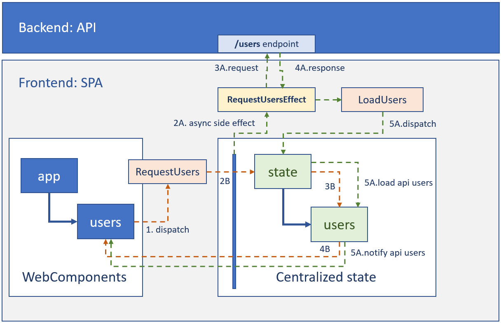

# Introducción

Esta aplicación provee la funcionalidad de visualización de todos los datos de los usuarios.

# Arquitectura lógica, física y flujo de datos

Empezaremos por el flujo de datos para guiar la motivación de la aplicación por la funcionaldiad que implementa. El flujo de datos es el siguiente:

Este gráfico además nos sirve para explicar también la arquitectura física:
* Tenemos un backend con una web api, que tiene un endpoint ('/users') que devuelve en JSON los usuarios.
* Tenemos un frontend con una SPA (Single Page Application), que internamente a nivel lógico se divide en :
	* **WebComponents**: Donde aplicamos un patrón Model-View-ViewModel jerárquico (un componente tiene componentes dentro).
	* **Centralized state**: Donde la relación entre los componentes y el estado (el estado es el momento de datos que vive la aplicación en cada momento) se hace mediante ngrx que propone una gestión del estado funcional similar a redux y una relación con los side effects que se derivan de las acciones de estilo reactivo.

# Desarrollo

1. TODO: añadir herramienta de linting con reglas en base a estándares del stack de angular.
1. TODO: añadir herramienta de generación de documentación.
1. TODO: añadir test de end to end (si tuvieramos control del api).

## Convenciones en testing

La carpeta de "_specs" debe estar cercana al elemento que queremos probar. Con "_" para que se vea arriba y mejorar la productividad.

Partes de un test:
`
describe('The [SUT]', () => {

	it('[SPEC]', () => {
		[ARRANGE]

		[ACT]

		[ASSERT]
	});
});
`

Donde:

* [SUT]: Subject under test. Lo que se está probando.
* [SPEC]: Especificación o regla que debe cumplir el SUT.
* [ARRANGE]: Instrucciones de preparación del tests. Las instrucciones deben ir seguidas sin lineas en blanco. Al finalizar las instrucciones de arrange ponemos un espacio en blanco para especificar que hemos terminado las instrucciones de preparación.
* [ACT]: Actuar, ejecutar la acción que queremos probar. Al final de las instrucciones de Act debemos poner un espacio en blanco.
* [ASSERT]: Aserción o verificación: verificar que el comportamiento es el esperado. Normalmente debe haber una verificación por test. A veces una verificación requiere más de una comprobación.

# Preguntas abiertas:

* ¿Cómo mejorarías la aplicación?

	* Implementando los TODOs marcados en la sección de arriba.
	* Si los usuarios fueran muchos añadiría o bien:
		* Paginación en cliente si hubiera alguna restricción del tipo que debe funcionar en offline.
		* Paginación en servidor si hay escenario online.
		* Aplicaría el patrón Flyweight pattern reutilizando las instancias de componentes que entraran en el viewport, adaptaría los que se renderizan a los que entran en el viewport del dispositivo. Esto es para no tener que manejar eventos, bindear componetnes, construirlos, etc sin que se puedan utilizar al no estar al alcance del usuario.
	* Crearía documentación de componentes y tutoriales.
	* Haría los asserts de render de los campos del usuarios con expresiones regulares en vez de "include" simplemente, que te podría crear falsos positivos.
	* Si la actualización del dato no fuera un problema probablemente metería caché local de usuarios (si no varía prácticamente nada podría ser en el storage siempre que por compatibilidad de nuestros clientes pudiera utilizarlo). Si variara poco lo haría en memoria para que no se repitieran requests de usuarios.
	* Metería documentación de tipo ADR (Architecture Decision Record) explicando las decisiones de diseño.
	* Metería CI y CD con ejecución de tests unitarios de integración y end to end.
	* Añadiría una imagen de docker para tener el mismo entorno en local que en producción. Con una build multi-stage dentro del contenedor para asegurarme que el agente ejecutar todos los pasos incluyendo tests.
	* Añadiría un tests que verificara el linting de la aplicación.
	* Optimizaría los bundles para ES5 o ES6 dependiendo de los navegadores clientes que lo consumieran.
	* Metería lazy load si hubiera más features (por ejemplo la de añadir usuarios) para mejorar la primera carga.
	* ...supongo que muchas cosas más que mejorar

* ¿Cómo implementarías un sistema CRUD de usuarios?
	* Añadiría los métodos al agente de usuarios para crear, eliminar, actualizar usuarios.
	* Añadiría los efectos y las acciones al igual que para solicitar usuarios.
	* Añadiría probablemente un botón en el componente de usuarios para levantar un popup que tuviera los campos, metería validaciones en los campos para no poder crear un usuario ni actualizarlo con datos inválidos. El popup sería un componetne independiente y el formulario de creación de usuarios (con las validaciones) iría en otro componente diferente.
	* Haría test de todo. 
	* Lo ideal sería hacerlo haciendo pairing, con reviews de specs, test, code, etc.
